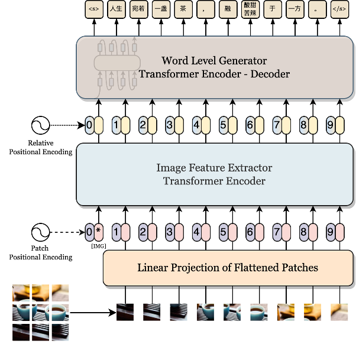
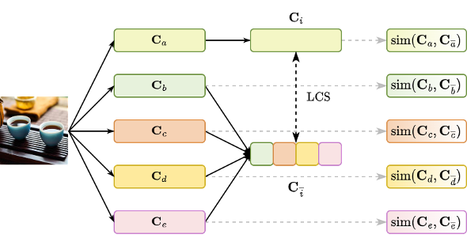

# ViT5P(ViT-T5P for Image Caption)

首届"兴智杯"全国人工智能创新应用大赛-技术创新专题赛-[多模态技术创新赛-图像描述生成](http://www.aiinnovation.com.cn/#/trackDetail?id=27)赛道 Rank5(CIDER-D 16.854) 解决方案.

方案优点:

1. 基于词生成, 缩小序列生成长度, 推理速度快. 
2. 单模型集成, 能够充分利用单个模型的生成潜力.
3. 两个base模型串联, 相对来说参数较少, 总参数量等价于一个ViT Large, 并且结构十分简单. 

## 解决方案

### ViT5P

模如其名, 模型由**ViT**和**T5-Pegasus**构成, 模型概览图如下:

<div align="center">
    
</div>

### 两阶段微调

我们把微调过程拆分为两个阶段:

1. 第一阶段, 直接随机采样训练, 使模型能够接触到更丰富多样的描述. 
2. 第二阶段, 使用精选的参考句重新构造的数据集进行微调, 使模型能生成更侧重细节的描述.

数据集具体构建方式如下:

参考[T5-Pegasus](https://kexue.fm/archives/8209)中构建伪摘要的方法, 分别从参考句中选出一部分句子拼接起来, 计算其与剩余参考句拼接的**最长公共子序**列作为分数, 按得分降序取Top-K作为第二阶段数据集中的参考句.

### 单模型集成

与两阶段微调类似, 沿着最长公共子序列的设计思路, 计算生成的每一条图像描述与其他所有描述的拼接之间的最长公共子序列, 作为相似度得分:

<div align="center">
    
</div>

选相似度最大的作为最终描述.

## 使用方法

### 配置环境

```shell
pip install -r requirements.txt
```

### 数据集准备

从[“兴智杯”全国人工智能创新应用大赛](http://www.aiinnovation.com.cn/#/trackDetail?id=27)下载数据.

接着运行预处理:

```shell
cd tools
python dataset_process.py
```

### 配置预训练模型

下载预训练模型到`pretrained_model`下:
 - ViT: [google/vit-base-patch16-224](https://huggingface.co/google/vit-base-patch16-224).
 - T5-Pegasus: [renmada/t5-pegasus-pytorch](https://github.com/renmada/t5-pegasus-pytorch).

### 训练 / 测试

推荐使用`nohup`完成训练 / 测试.

训练:
```shell
cd shell
./train_stage1.sh
./train_stage2.sh
```

测试:
```shell
cd shell
./predict.sh
```

## Q & A

 - Q: Image Caption中常直接用SCST直接优化CIDER-D, 为什么不使用?
 
   A: SCST计算太慢, 直接用交叉熵做Loss.

- Q: 词生成与字生成相比, 有什么优势?

    A: 相较于字生成的方法, 所有的参考句长度都比字生成短, 每个句子的序列长都缩小了10%～35%不等. 这种目标序列缩短对自回归模型比较友好, 而且因为词语会以整体为单位被预测出来, 生成的句子更流畅, 并且不会丢词串词.

- Q: 为什么要采用两阶段微调?

    A: 考虑到数据集中参考句数量差异较大, 采用两阶段微调可以缓解训练不平衡问题. 

- Q: 为什么要采用单模型集成? 

    A: 由于CIDER-D计算涉及到词频, 同模型的不同参数设置可能差异比较大, 因此集成起来效果可能会好些.


## 特别鸣谢

感谢苏神的文章[《T5 PEGASUS: 开源一个中文生成式预训练模型》](https://kexue.fm/archives/8209)中构造伪摘要数据的方法, 带给了我们很多启发.